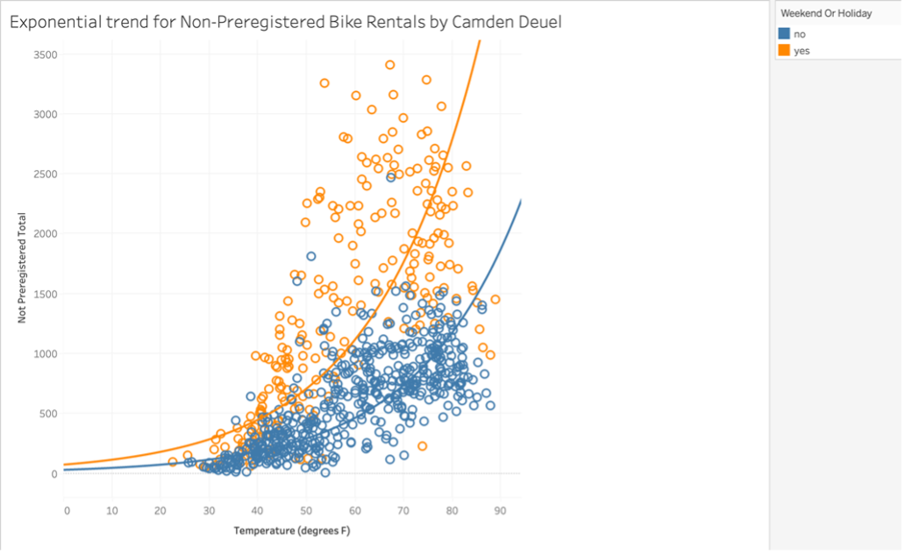
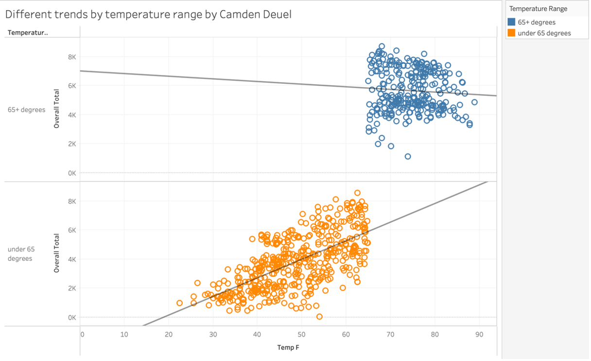
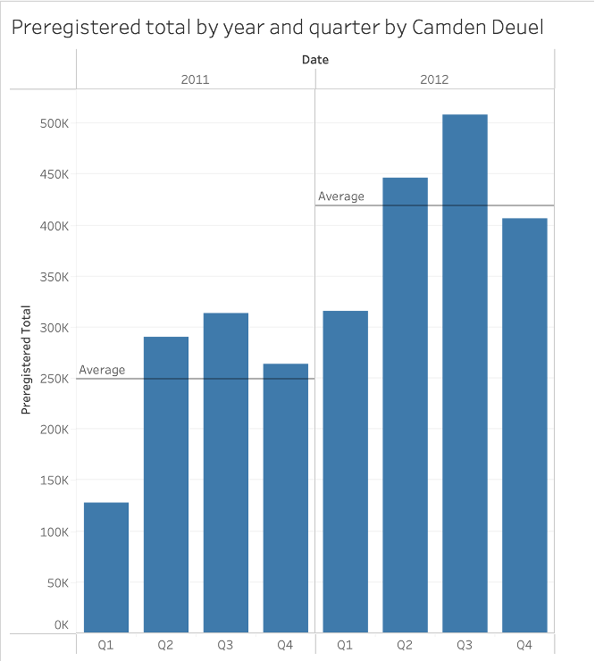

# Bike Share Usage Analysis

## Overview
This project analyzes bike-sharing rental data to determine how temperature, seasonality, and calendar effects influence rider demand.

## Tools Used
- Tableau
- Statistical Analysis

## Key Findings
- Temperature strongly impacts rental demand
- Demand plateaus above 65°F
- Winter shows the strongest temperature-demand relationship

# Bike Share Usage Analysis

## Overview
This project analyzes how temperature and seasonality influence bike rental demand.

## Key Finding #1: Temperature Drives Demand

An exponential model better explained the relationship between temperature and non-registered rider demand than a linear model.

### Linear Model

### Exponential Model

## Key Finding #2: Seasonal Differences

Temperature had the strongest impact on rentals during winter and the weakest impact during summer.

## Key Finding #3: Demand Plateaus Above 65°F

Rental growth was strong below 65°F but much weaker above that threshold.

## Additional Visualizations

### Heatmap

### Quarterly Rental Trends

