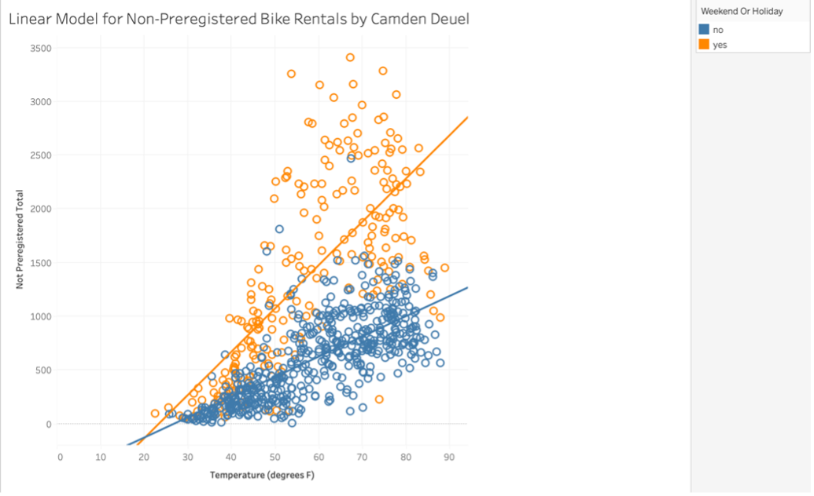
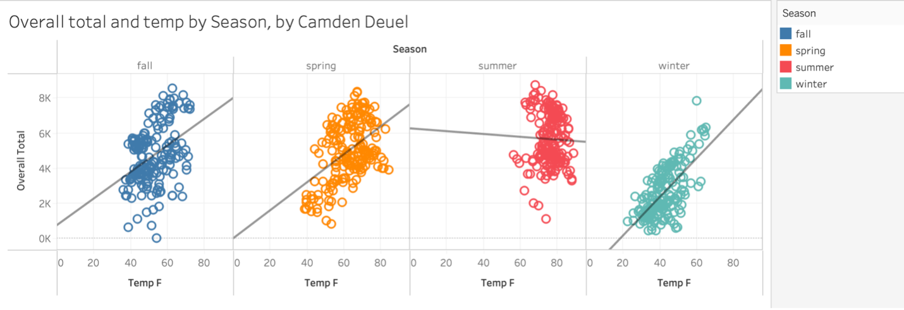

# Bike Share Tableau Analysis

## Overview

This analysis uses Tableau to examine bike-sharing rental data and identify how temperature, seasonality, and calendar effects influence rider demand. The objective was to uncover trends in customer behavior, evaluate the relationship between weather conditions and rentals, and develop visualizations that support data-driven decision-making.

## Tools Used

Tableau

Data Visualization

Dashboard Development

Statistical Analysis

## Business Questions

### How does temperature impact bike rental demand?

Analyzed the relationship between temperature and rental activity using linear, exponential, and polynomial trend models.

### Does the relationship between temperature and rentals vary by season?

Compared rental demand across winter, spring, summer, and fall to identify seasonal differences in rider behavior.

### Is there a temperature threshold where rental demand levels off?

Evaluated rental activity above and below 65°F to determine whether demand continues increasing at higher temperatures.

### How do rental patterns change throughout the year?

Used heatmaps and quarterly trend analysis to identify monthly, weekly, and seasonal usage patterns.

### How has rider activity changed over time?

Examined quarterly rental trends to compare rider activity across multiple years and identify growth patterns.

## Tableau Techniques Demonstrated

* Heatmaps
* Scatter Plots
* Trend Lines
* Exponential Modeling
* Polynomial Modeling
* Bar Charts
* Calculated Fields
* Dashboard Development

## Skills Demonstrated

* Data Visualization
* Statistical Analysis
* Trend Analysis
* Business Intelligence
* Dashboard Development
* Exploratory Data Analysis
* KPI Reporting
* Data Storytelling

## Visualizations

### Linear Model

### Exponential Model

### Seasonal Analysis

### Polynomial Trend Analysis

### Temperature Threshold Analysis

### Heatmap

### Quarterly Rental Trends

