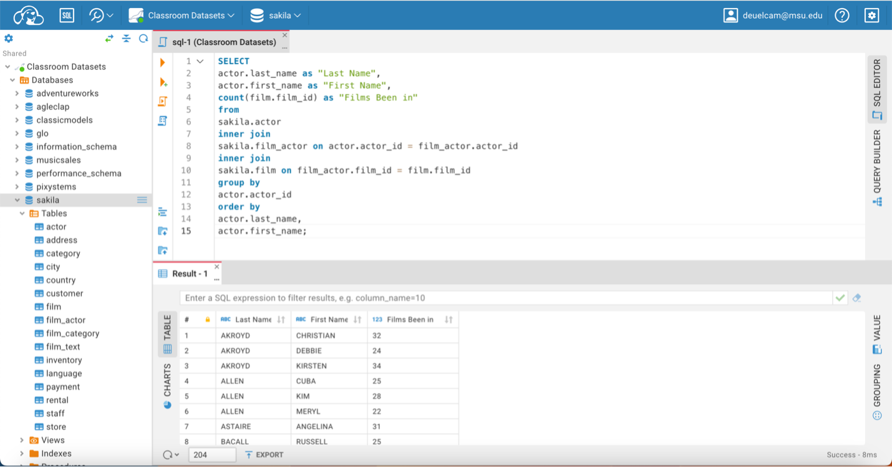
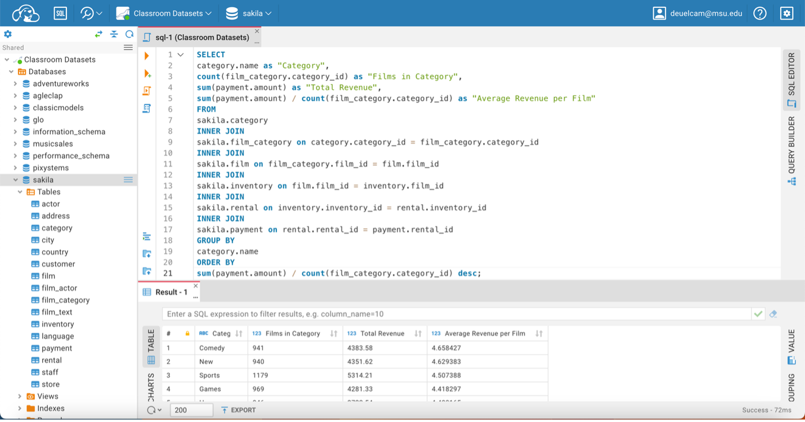

# Sakila Movie Rental Business Analysis

## Overview

This project uses SQL to analyze operational and financial data from the Sakila movie rental database. The objective was to answer business-focused questions related to inventory management, revenue generation, customer demographics, and store performance.

## Tools Used

- SQL
- MySQL
- Relational Databases
- Data Analysis

## Business Questions

### Which actors appeared in the most films?
Used joins between actor, film_actor, and film tables to determine actor participation across the film catalog.

### What is the inventory value of each store?
Calculated inventory counts and replacement costs for each store location.

### Which movie categories generate the most revenue?
Analyzed rental and payment transactions to calculate total and average revenue by category.

### How does actual rental revenue compare to expected rental revenue?
Compared customer payments against expected rental charges.

### Which countries have the largest customer bases outside the United States?
Examined international customer distribution using customer, address, city, and country data.

## SQL Techniques Demonstrated

- INNER JOIN
- GROUP BY
- HAVING
- ORDER BY
- COUNT()
- SUM()
- Multi-table relational analysis

## Skills Demonstrated

- Database Querying
- Data Analysis
- Revenue Analysis
- Inventory Analysis
- Customer Analytics
- Business Intelligence

## Query 1: Actor Film Analysis

## Query 2: Store Inventory Analysis

## Query 3: Category Revenue Analysis

## Query 4: Store Performance Analysis

## Query 5: Customer Geography Analysis

