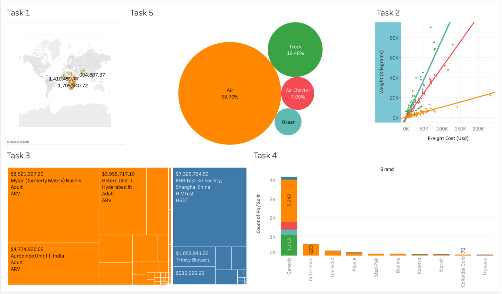

# Bike Share Usage Analysis

## Overview

This project uses Tableau to analyze bike-sharing rental data. The objective was to identify how temperature, seasonality, and calendar effects influence rider demand while developing visualizations to uncover trends in customer behavior and rental activity.

## Tools Used

Tableau
Data Visualization
Statistical Analysis
Trend Modeling

## Business Questions

### How does temperature impact bike rental demand?

Analyzed the relationship between temperature and bike rental activity using linear, exponential, and polynomial trend models.

### Does the relationship between temperature and rentals vary by season?

Compared rental demand across winter, spring, summer, and fall to determine how seasonal conditions influence rider behavior.

### Is there a temperature threshold where rental demand levels off?

Evaluated rental activity above and below 65°F to identify whether demand continues increasing at higher temperatures.

### How do rental patterns vary throughout the year?

Used heatmaps and trend analysis to identify monthly, weekly, and seasonal usage patterns among riders.

### How has rider activity changed over time?

Examined quarterly rental trends to compare rider activity across multiple years and identify growth patterns.

## Tableau Techniques Demonstrated

* Heatmaps
* Scatter Plots
* Trend Lines
* Exponential Modeling
* Polynomial Modeling
* Bar Charts
* Calculated Fields
* Dashboard Development

## Skills Demonstrated

* Data Visualization
* Statistical Analysis
* Trend Analysis
* Business Intelligence
* Dashboard Development
* Exploratory Data Analysis
* KPI Reporting
* Data Storytelling

## Tableau Dashboard

